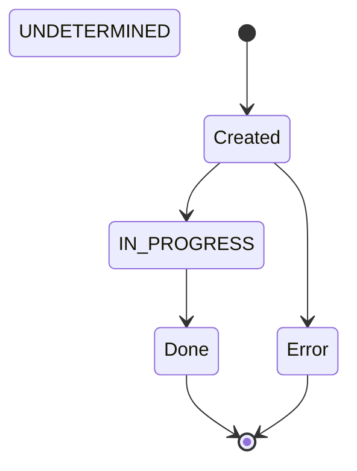
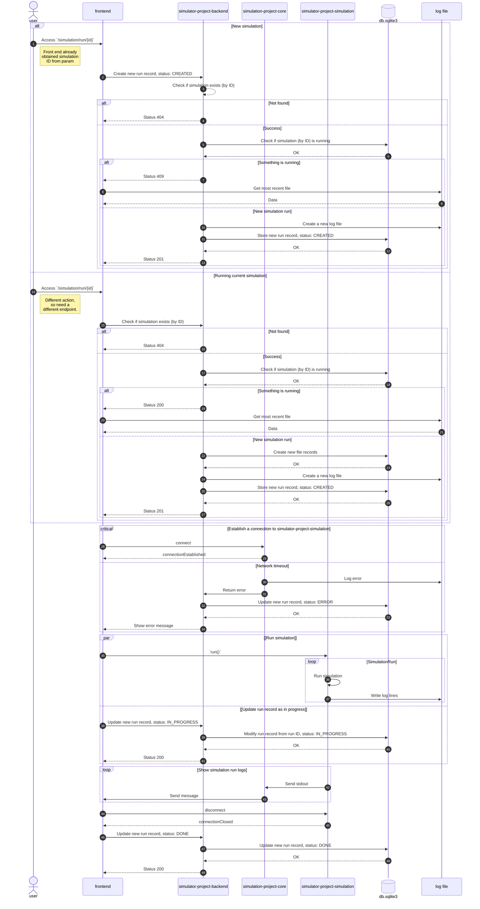
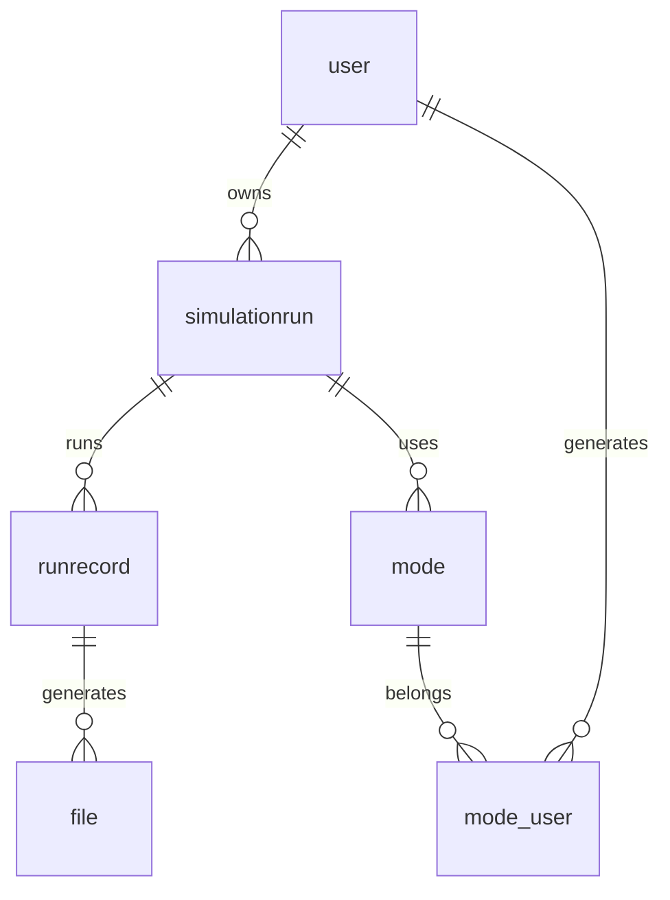

# Contribute
Pull requests are welcome. For major changes, please open an issue first to discuss what you would like to change.

Please make sure to update tests as appropriate.

This page serves as a knowledge base for maintaining the code base under this project. This includes front end, both back ends and the simulation core. 


## Simulation Run
A simulation run is the core of this project. It is a lifecycle of capturing the instructions and produce data files based on the simulation. To manage the simulations runs, each simulation run has a state. This is shown below: 

> [!NOTE]
> In this project, we use **simulation** to call the instructions and any metadata of the simulation itself. While we use **simulation run** to call each complete lifecycle of simulation attempts. So for each **simulation** we can have multiple **simulation runs**. 



* **Created** is the start of each simulation run's lifecycle. It means a simulation run has been created. 
* **In progress** means the simulation run is running. 
* **Done** means the simulation run is completed and the data files has been exported (Some files has been progressively exported to its destination already). 
* **Error** occurs when the simulation run has encountered an unchecked error with a non-zero exit code. This is one of the terminus 

If the simulation does not have any status entailed onto it. It could be labeled as **undetermined**. 

To start the simulation run, the user should enter from the page `simulation/run/{id}`. It has a complex process as stated below: 


If the simulation run status is blank or anything else, the status should be `"Undertermined"`. 

## Structure of Front End 
This application uses [App Router](https://nextjs.org/docs/app/getting-started/project-structure) from Next.JS. This defines the folder structure you see in here. 

Under the `app/` folder, there are two folders: `(core)`and `(docs)`. They are the route groups. This dos not change the URL structure, but they are needed because they uses different root providers: The core uses a custom made provider, while the documentations are provided by FumaDocs. 

The `app/ui` folder contains the global CSS definitions. Shall you need to create the styles please put them under the `global.css` file.

## Documentation Page (Front End)
The documentations accessed by normal front end UI captures the knowledge base for using the application by normal means. While the markdown files here are meta instructions (e.g. maintain the code base). 

From the front end the URL is `<url>/docs`. For example, in local it is `localhost:3000/docs`

### Add a New Page
You can add a page under `/frontend/content/docs/` or its subfolders. The pages under subfolders will become under different sections in the documentation. 

### Add a New Section
1. Create a new folder under `/frontend/content/docs/`
2. Under the new folder create:
	* `meta.json` which contains the pages required. 
	* Any `.mdx` files
3. At the `meta.json` file of the parent folder, add the folder name as one of the pages. For example 
	```
	{
		"pages": [ "index", "faq", "simulation", "tutorial" ]
	}
	```
	If `"simulation"` is the child folder. 

### Add Images
The images are located from `/public`. Hence when refering them use this as the root folder. For example, documentations are has a path of `/docs/`.


## Simulation Inventory Database

There are 2 databases which is used in this solution: 
* Relational database `db.sqlite3` which records the stock of the simulations
* A NoSQL database (probably MongoDB) to store the simulation details or logs (Not implemented)

This section is dedicated to the relational database. It uses SQLite since: 
* It is the default db provider for Django and I do not have any preferencs in early stage of the project. Hence the database name reflects the default name from Django. 
* It is lightweight with basic SQL functions still allowed. This will be important when the database grows. 

The database called `db.sqlite3`, contains 6 tables which is shown below: 


* `simulationrun` is the core table
* `runrecord` stores the simulation run information. 
* `mode` stores information of the simulation options. 
* `file` stores the metadata of the files generated by each simulation run. 
* `user` is provided by Django by default. It represents the logged in users. 
* `mode_user` is the composite table between the `modes` and `users`. Which represents which user creates these modes. 

## Git Branch Rules