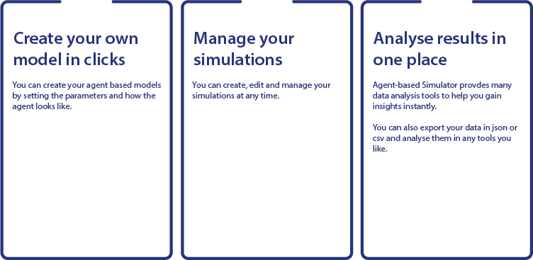

# Agent Based Simulator

> [!NOTE]
> This is still in development (beta). You are more than welcome to contribute and let me know to review them. 

This is a web app based agent based simulator. It is aimed to be easy to generate agent based simulations and assists analysis and decision making on the models. 

## Install

To start the service, you will need: 
1. Under `frontend` folder, use the command `npm run dev`. 
2. Under `simulator-project-backend`, use the command `py manage.py runserver`. 
3. Under `simulator-project-core`, use the command `py manage.py runserver 8081`. This services uses port 8081. 

Future state will see this is turned on through Docker. 

## Usage
You can either
* use the web app
* simulate directly from simulator

## Tech Stack

### Front end 
The front end uses Next.JS, a React framework. It allows a user-friendly experience to create, manage and analyse agent base model simulation. 

### Back end
This is a Django Rest Framework application and the database is part of this. 

### Core
This is a Django Channel Rest Framework application which aims to read from stdout from `simulation-project-simulator` and sends to `simulation-project-frontend`. 

### Simulator
This is a plain Python module with the simulation code. 

## FAQ

## To-do
* Front end error handling
* Update simulation status (front end and core)
* Pick-up running simulations
* Documentations
	* How to start simulation
	* How to create simulation
* Docker
* 418 page (April fools)
* Games corner (and other fun Easter eggs stuff)

## Contribute

Pull requests are welcome. For major changes, please open an issue first to discuss what you would like to change.

Please make sure to update tests as appropriate.

## License
[MIT](https://choosealicense.com/licenses/mit/)

