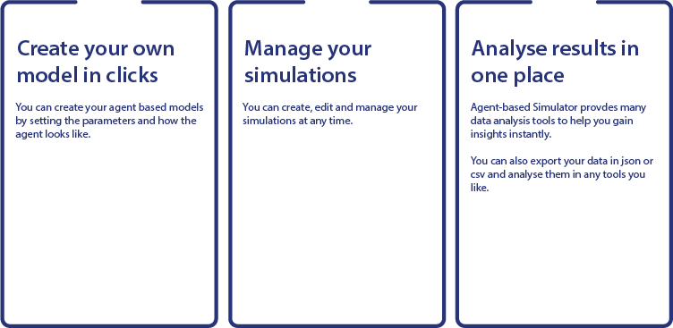

# Agent Based Simulator
[](https://www.figma.com/design/TBvv2v23gxd60YKJN6rGNQ/Agent-Based-Simulator)


> [!NOTE]
> This is still in development (beta). You are more than welcome to contribute and let me know to review them. 

This is a web app based agent based simulator. It is aimed to be easy to generate agent based simulations and assists analysis and decision making on the models. 



## Install

### Prerequisites
You need **Node.js** (which provides `npm`) and **Python** (which provides `pip`).

**Node.js 20+** (project verified on Node 24) — provides the `npm` CLI.
* macOS: `brew install node` or download from [nodejs.org](https://nodejs.org/)
* Windows: installer from [nodejs.org](https://nodejs.org/)
* Linux: use your distro package manager, or [nvm](https://github.com/nvm-sh/nvm)
* Verify: `node --version && npm --version`

**Python 3.10+** — provides `pip` (invoke as `python3 -m pip` on macOS/Linux, `py -m pip` on Windows; the bare `pip` command isn't always on PATH).
* macOS: `brew install python` or download from [python.org](https://www.python.org/downloads/)
* Windows: installer from [python.org](https://www.python.org/downloads/) (tick "Add Python to PATH")
* Linux: use your distro package manager (e.g. `apt install python3 python3-pip`)
* Verify: `python3 --version && python3 -m pip --version` (Windows: `py --version && py -m pip --version`)

### Install dependencies
Run both blocks from the repo root.

1. Frontend deps (Node — note the `cd frontend`, there's no top-level `package.json`):
   ```bash
   cd frontend && npm install && cd ..
   ```
2. Backend / Core / Simulator Python deps. Modern Python installs (Homebrew, recent Debian/Ubuntu) block system-wide `pip install` per [PEP 668](https://peps.python.org/pep-0668/), so use a virtualenv:
   ```bash
   python3 -m venv .venv
   source .venv/bin/activate       # Windows: .venv\Scripts\activate
   python3 -m pip install -r requirements.txt
   ```
   Reactivate the venv (`source .venv/bin/activate`) in any new terminal before running the backend or core services.

### Run the service
Open three terminal tabs from the repo root and paste one block per tab. Each block is self-contained — it `cd`s to the right directory and (where needed) activates the venv, so the order of starting tabs doesn't matter. Replace `python3` with `py` and `source .venv/bin/activate` with `.venv\Scripts\activate` on Windows.

**Tab 1 — Frontend** (http://localhost:3000)
```bash
cd frontend && npm run dev
```

**Tab 2 — Backend** (http://localhost:8000)
```bash
source .venv/bin/activate && cd simulator-project-backend && python3 manage.py runserver
```

**Tab 3 — Core** (http://localhost:8001 — WebSocket server)
```bash
source .venv/bin/activate && cd simulator-project-core && daphne -p 8081 simulationProject.asgi:application
```
The core service streams simulation logs over WebSockets, so it **must** be run via Daphne (the ASGI server), not plain `manage.py runserver`. Using `runserver` returns HTTP 404 on `/ws/simulation/` and breaks the run page.

Future state will see this is turned on through Docker. 

## Usage
You can either
* use the web app
* simulate directly from simulator

## Tech Stack


### Front end 
The front end uses Next.JS, a React framework. It allows a user-friendly experience to create, manage and analyse agent base model simulation. 

### Back end
This is a Django Rest Framework application and the database is part of this. 

### Core
This is a Django Channel Rest Framework application which aims to read from stdout from `simulation-project-simulator` and sends to `simulation-project-frontend`. 

### Simulator
This is a plain Python module with the simulation code. 

## FAQ


## To-do
* Update simulation status (front end and core)
* Authenication
* Logo for this whole project
* Simulation structure/ language
* Docker
* 418 page (April fools)
* Games corner (and other fun Easter eggs stuff)

## Contribute

Pull requests are welcome. For major changes, please open an issue first to discuss what you would like to change.

Please make sure to update tests as appropriate.

## License
[MIT](https://choosealicense.com/licenses/mit/)

