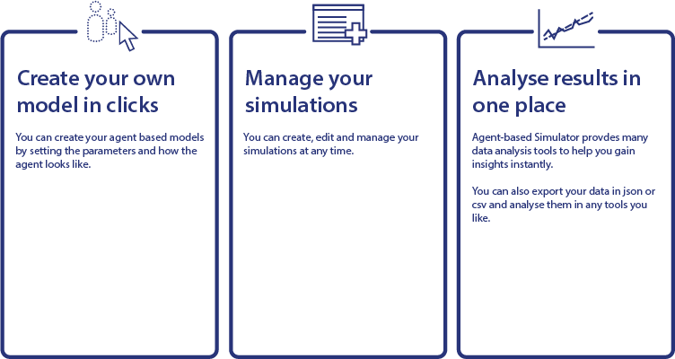

# Agent Based Simulator

> [!NOTE]
> This is still in development (beta). You are more than welcome to contribute and let me know to review them. 

This is a web app based agent based simulator. It is aimed to be easy to generate agent based simulations and assists analysis and decision making on the models. 

## Install

## Usage

## Tech Stack

## FAQ

## Contribute

Pull requests are welcome. For major changes, please open an issue first to discuss what you would like to change.

Please make sure to update tests as appropriate.

## License
[MIT](https://choosealicense.com/licenses/mit/)

