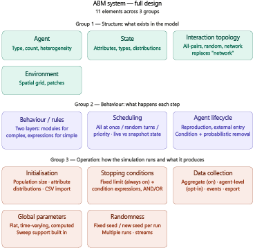

# Creating Agents

## Purpose

This document describes the overall design of the simulation configuration
wizard: the set of elements a user walks through to define a runnable
agent-based model (ABM), and the architectural decisions behind how that
wizard is built and rendered.

**Audience:** maintainers who need to understand how the wizard is
structured, why it's grouped the way it is, and where a given piece of
configuration logic belongs.

**Status:** design finalised; implementation in progress. Step 1 (Agent) is
implemented — see `step-1-agent.md`. All other steps are scoped but not yet
built.

---

## Shared architecture

The CLI wizard and the web wizard are two renderers over the **same
underlying data models**. Neither renderer owns validation or business
logic — that lives in the shared models (e.g. the Pydantic models used for
Agent). This means:

- A new element/step is added once, at the model layer.
- The CLI and web renderers only need to know how to *render* and *collect
  input* for a given model; they should not duplicate validation logic.
- Draft/save-and-resume behaviour is a property of the shared model +
  serialisation (JSON/YAML), not of either renderer.

## Wizard flow decisions

- **Phase-level stepper with secondary sub-nav** (Option C): the top-level
  navigation shows the three phases (Structure / Behaviour / Operation),
  and within a phase there's a secondary nav across that phase's elements.
- **Blocking validation on the current step**: a user cannot move forward
  from an invalid step. There is no "continue with warnings" path.
- **Rules and Scheduling share one page**, split by section dividers,
  rather than being two separate steps.
- **Agent and State remain separate steps**, despite both being part of
  "what exists in the model," because they have distinct concerns (agent
  typing/population vs. attribute schema).

Design system, component library, and full screen flows for the wizard UI
are tracked separately in ticket **DESIGN-01**.

---

## The 11 elements, by group

### Group 1 — Structure: what exists in the model

| Element | Covers | Detail            | 
|---|---|-------------------|
| **Agent** | Type, count, heterogeneity | `step-1-agent.md` |
| **State** | Attributes, types, distributions | `step-2-state.md` |
| **Interaction topology** | All-pairs, random, network (replaces the old standalone "Network" element) |                   |
| **Environment** | Spatial grid, patches |                   |

### Group 2 — Behaviour: what happens each step

| Element | Covers | Detail | 
|---|---|---|
| **Behaviour / rules** | Two layers: pre-built modules for complex logic, expression fields for simple state updates | |
| **Scheduling** | All-at-once / random turns / priority ordering; live vs. snapshot state updates | |
| **Agent lifecycle** | Reproduction, external entry; condition-based + probabilistic removal | |

### Group 3 — Operation: how the simulation runs and what it produces

| Element | Covers | Detail | 
|---|---|---|
| **Initialisation** | Population size, attribute distributions, CSV import | |
| **Stopping conditions** | Fixed limit (always on) plus condition expressions, AND/OR | |
| **Data collection** | Aggregate (on by default), agent-level (opt-in), events, export | |
| **Global parameters** | Flat, time-varying, or computed; sweep support built in | |
| **Randomness** | Fixed seed or new seed per run; multiple runs; multiple streams | |

A **Review** stage follows all three groups, before a config can be executed.

---

## Key design decisions

**Network → Interaction topology.**
"Network" was originally its own element. It's now a dropdown on the
Behaviour step rather than a standalone Structure element. All-pairs and
random are supported first; explicit network topology is a later addition;
spatial proximity is handled via Environment instead of Interaction
topology.

**Behaviour → two-layer system.**
Pre-built modules (sourced from prior research code — e.g. SIR infection,
vaccine adoption) handle complex logic. Expression fields handle simple
state updates. This split keeps common patterns fast to configure without
blocking custom logic.

**Scheduling → two levels.**
Scheduling decisions happen at two levels: *across agents* (who acts first
each step) and *within an agent* (action order and state visibility).
Labels are plain-language (not "sync"/"async"). Conflict resolution is
always explicit rather than implied. Per-behaviour scheduling overrides are
deferred to v2.
