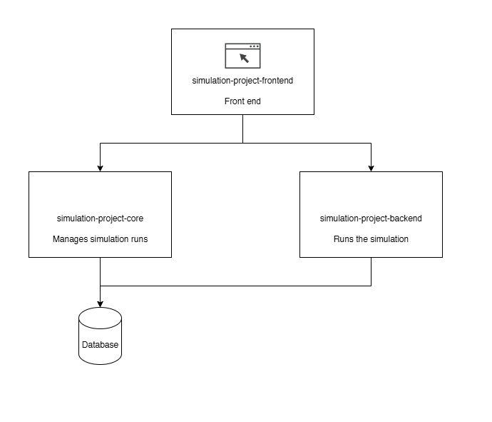

# Simulation Project

Part of the whole simulation full stack system. This is a backend to manage your simulations. 

This is part of the whole 3-tier architecture: 

## Features

## Getting Started

## Installation
You need to install the following libraries
* `daphne`
* `django`
* `django-cors-headers`
* `djangorestframework`
* `djangochannelsrestframework`

## Contributing