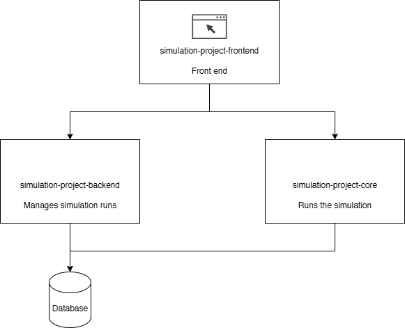

# Simulation Project

Part of the whole simulation full stack system. This is a backend to manage your simulations. 

This is part of the whole 3-tier architecture:

## Features

## Getting Started
To start this application, please run `py manage.py runserver 8001`. This will run the application under port `8001`. 

## Installation
You need to install the following libraries
* `daphne`
* `django`
* `django-cors-headers`
* `djangorestframework`
* `djangochannelsrestframework`

Add the requirements from `requirements.txt` at the root folder. It is recommended to create a virtual environment (i.e. a new `.venv` folder) at the root folder. 

## Contributing